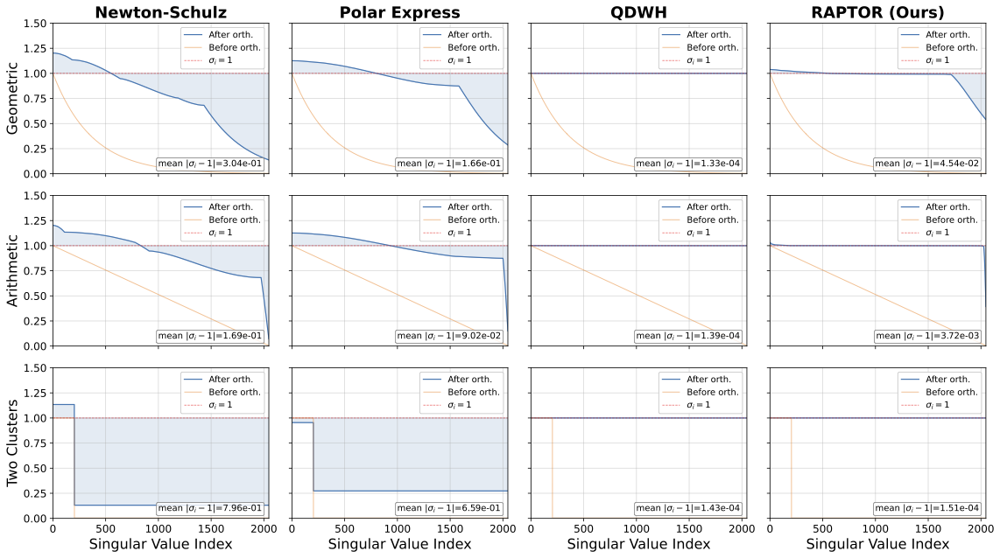

# RAPTOR

This repository contains the code for RAPTOR, a new approximation of the matrix sign function, the operation behind Muon, that flattens all singular values to one. 
This method accelerates the golden standard QDWH by solving the matrix inverses in QDWH's rational iterations with the truncated conjugate gradient method. 
By automatically absorbing the truncation errors, RAPTOR achieves the QDWH-level accuracy with a Newton-Schulz-level computational cost.


This image shows how RAPTOR and other algorithms flatten the singular values of a 2048x2048 random matrix, whose condition number is 256, in five iterations. 

# Requirements

`Python>=3.12` and `torch>=2.11` are expected.

# Usage

```python
import torch
from raptor import raptor

matrix = torch.randn(2048, 2048, dtype=torch.float32, device="cuda")
ortho_matrix = raptor(
    matrix,
    num_iters=5,
    cg_steps=3,
)
```

# Citation

```
@inproceesings{hataya2026raptor,
    title={{RAPTOR: Accurate and Scalable Rational Polar Decomposition for the Muon Algorithm}},
    author={Ryuichiro Hataya},
    year={2026},
    booktitle={ECML-PKDD},
}
```